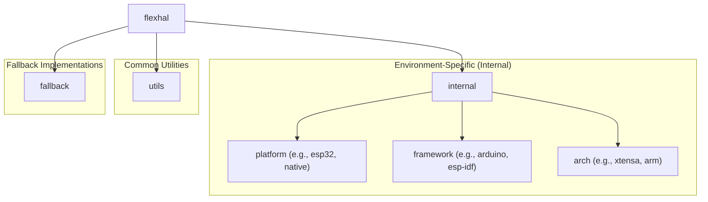

## 名前空間 (Namespace) のルール

`FlexHAL` のコードはすべて `flexhal` 名前空間内に配置されます。

### トップレベル構造 (`flexhal::*`)

`flexhal` 名前空間の直下には、主に **環境に依存しない共通の機能** が配置されます。

- **共通インターフェース:** 各種ハードウェア機能 (GPIO, SPI, I2C, Timer など) の基本的な操作を定義する抽象クラスや型定義。
    - 例: `flexhal::gpio`, `flexhal::bus`, `flexhal::timer`
- **コア機能:** ライブラリの基本的な動作に必要な、環境非依存のクラスや関数。
    - 例: (もしあれば `flexhal::core` など)
- **ユーティリティ:** ログ出力、エラー処理など、汎用的に使える補助的な機能。
    - 例: `flexhal::utils`
- **フォールバック実装:** プラットフォーム非依存の基本的なフォールバック実装。
    - 例: `flexhal::fallback`

### 環境依存実装 (`flexhal::internal::*`)

特定のCPUアーキテクチャ、チップ、フレームワーク、RTOSなどに依存するコードは、すべて `flexhal::internal` 名前空間以下に配置されます。これにより、環境依存部分が明確に分離されます。

- **`flexhal::internal`**: 特定の環境（プラットフォーム、フレームワーク、CPUアーキテクチャ）に依存する実装クラスや関数を格納します。
  - **役割**: この名前空間内の要素は、通常ユーザーが直接利用することは**推奨されません**。
  - **原則**:
    - 具体的な実装は、さらに下の `platform`, `framework`, `arch` サブ名前空間に配置されます。
  - **サブ名前空間**:
    - **`flexhal::internal::platform`**: 特定の実行環境プラットフォーム固有の実装。
    - **`flexhal::internal::framework`**: 特定のソフトウェアフレームワーク固有の実装。
    - **`flexhal::internal::arch`**: 特定のCPUアーキテクチャ固有の実装。

### 各階層の役割

- **`flexhal`**: ルート名前空間。
- **`flexhal::internal`**: 環境依存コードのルート名前空間。
  - **`flexhal::internal::platform`**: 特定の実行環境プラットフォーム固有の機能。
    - 例: `flexhal::internal::platform::esp32`
  - **`flexhal::internal::framework`**: 特定のソフトウェアフレームワーク固有の機能。
    - 例: `flexhal::internal::framework::arduino`
  - **`flexhal::internal::arch`**: 特定のCPUアーキテクチャ固有の機能。
    - 例: `flexhal::internal::arch::xtensa`
- **`flexhal::utils`**: 環境に依存しない共通ユーティリティ。
  - 例: `flexhal::utils::logger` (ロガーインターフェースなど)
- **`flexhal::fallback`**: プラットフォーム非依存の基本的なフォールバック実装。
  - 例: `flexhal::fallback::logger` (`printf` ベースのロガー)

### 注意点
- ライブラリの公開APIはすべて `flexhal` 名前空間内に配置する。
- 環境依存の機能は、さらにサブ名前空間（`internal`, `platform`, `framework` など）に分けて配置する。
- 共通ユーティリティは `utils` サブ名前空間に配置する。
- プラットフォーム非依存のフォールバック実装は `fallback` サブ名前空間に配置する。

### (参考) 詳細な階層構造案

**共通機能 (flexhal::*)**

- `flexhal::core` (もしコア機能があれば)
- `flexhal::utils`
  - `logger`
  - `error`
- `flexhal::gpio` (インターフェース)
- `flexhal::bus` (インターフェース)
  - `spi`
  - `i2c`
  - `i2s`
  - `uart` (uartp?)
  - `parallel`
- `flexhal::timer` (インターフェース)
- `flexhal::pwm` (インターフェース)
- `flexhal::adc` (インターフェース - 追加提案)
- `flexhal::dac` (インターフェース - 追加提案)
- `flexhal::can` (インターフェース - 追加提案)
- `flexhal::fallback`
  - `logger` (`printf` ベースのロガーなど)

**環境依存実装 (flexhal::internal::*)**

- `flexhal::internal::platform`
  - `esp32` (ESP32シリーズ共通)
    - `gpio` (実装)
    - `spi` (実装)
    - ... (各ペリフェラルの実装)
  - `esp32s2` (ESP32-S2固有)
  - `esp32s3` (ESP32-S3固有)
  - ... (他のESP32系チップ)
- `flexhal::internal::framework`
  - `arduino`
    - `gpio` (実装)
    - `spi` (実装)
    - ...
  - `esp_idf`
    - `gpio` (実装)
    - ...
  - `cmsis`
- `flexhal::internal::arch`
  - `xtensa`
    - `lx6` (例: ESP32)
    - `lx7` (例: ESP32-S3)
  - `arm`
    - `cortex_m` (例: M0, M4, M7)
  - `riscv`

